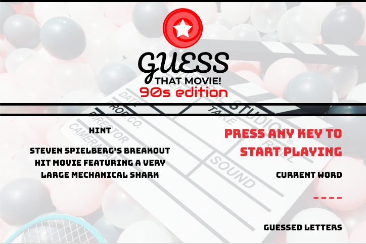

# Word-Guess-Game

This is a word guessing game that features dynamically updated HTML and CSS powered by javascript. The theme of the game is 90's movies.

## How it works

* A user is presented with one word, where the user needs to guess what the word is, one letter at a time.

* Each word comes with a hint. The user is shown placeholder underscores for each character in the word that needs to be guessed.

* If the user guesses a letter that is a character in the word to be guessed, then that correct letter is displayed amongst the placeholder characters.

* The user starts each word with 8 letter guesses. If they guess incorrectly then they lose a guess. If they guess correctly then the amount of guesses remaining does not change.

* If the user guesses incorrectly, the incorrect letter is displayed.

* As the game progresses the user's wins and losses are displayed in real time.

* At the end of the game, the user is shown their overall score of wins/losses and the game automatically restarts after 5 seconds.

### Try your luck by visiting the link below
https://willrackley.github.io/Word-Guess-Game/
